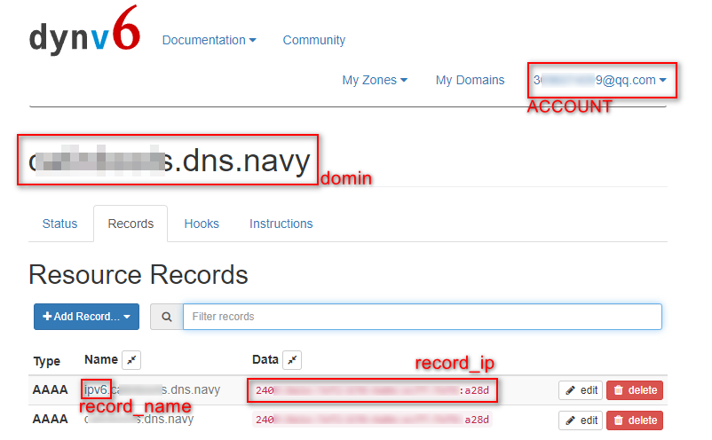

# 更新dynv6域名IP地址和record

- dynv6官方提供了HTTP API来更新IPv4/IPv6，但是不包括record。本仓库的脚本实现了通过HTTP请求来更新record。
- 由于我只使用IPV6地址，脚本中只更新ipv6地址，然后判断ipv6地址更新结果，如果是"addresses updated"，表示地址发生改变并更新成功，则同时进行更新AAAA记录，否则退出。

## 变量说明
- user_token：更新IPv4/6的HTTP API的Tokens，从[Keys](https://dynv6.com/keys)页面可以找到。
- domin：你的域名。
- record_name：将要更新IP的记录名称。（record_ip是记录的IP，脚本中自动获取，不需要手动设置）
- ACCOUNT/PASSWD：登录dynv6网站的账号信息。
 

## 其他说明
- 本脚本在padavan(with entware)下测试通过，脚本中的logger函数是padavan环境下的打印函数，其他环境请自行更改。
